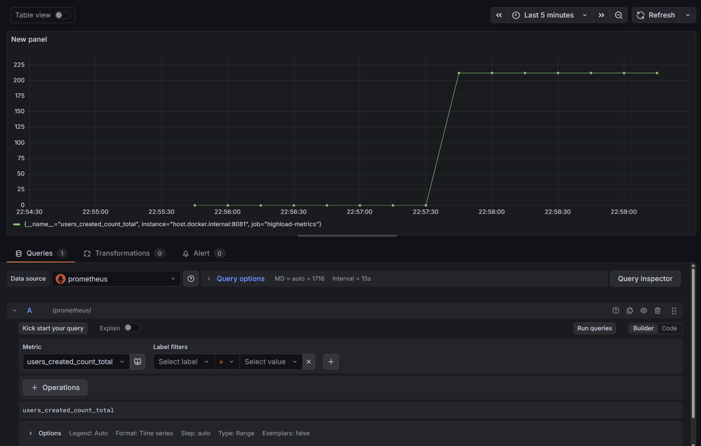

# highload

## Инструкция по локальному запуску приложения

- выполнить команду `docker compose up -d`
  - будет поднята бд postgres
  - сбилдится и запустится spring приложение
  - таблицы бд будут созданы при запуске приложения автоматически
- Postman-коллекции расположена по пути `postman/highload.postman_collection.json`

## Репликация

- Составил план нагрузочного тестирования в jmeter для запросов /user/get/{id} и /user/search
- Создал нагрузку на чтение для этих запросов. Отчет лежит в папке `jmeter/reports/replication/reading-load-without-replication`
- Поднял в докере 2 слейва и 1 мастер
- Запомнил маску сети
`docker network inspect highload | grep Subnet`
- Раскоментировал конфиги в файле `volumes/postgres-master/postgresql.conf`
  ```
  ssl = off
  wal_level = replica
  max_wal_senders = 10
  ```
- Подключился к мастеру и создал пользователя для репликации
  ```
  docker exec -it highload-master psql -U highload-user -d postgres
  create role replicator with login replication password 'pass';
  exit
  ```
- Добавил запись с подсетью
`host    replication     replicator      172.18.0.0/16           md5` в файл `volumes/postgres-master/pg_hba.conf`
- Перезапустил мастер
- Сделал бэкап для реплик
  ```
  docker exec -it highload-master bash
  mkdir /pgslave
  pg_basebackup -h highload-master -D /pgslave -U replicator -v -P --wal-method=stream
  exit
  ```
- Скопировал бэкап себе в проект в первую реплику
  ```
  rm -rf volumes/postgres-slave-1/
  docker cp highload-master:/pgslave volumes/postgres-slave-1/
  ```
- Создал файл в реплике, чтобы она узнала, что она реплика
  ```
  touch volumes/postgres-slave-1/standby.signal
  ```
- Поменял `postgresql.conf` на реплике `postgres-slave-1`
  ```
  primary_conninfo = 'host=highload-master port=5432 user=replicator password=pass application_name=postgres-slave-1'
  ```
- Скопировал бэкап во вторую реплику
  ```
  rm -rf volumes/postgres-slave-2/
  docker cp highload-master:/pgslave volumes/postgres-slave-2/
  ```
- Изменил настройки для второй реплики `volumes/postgres-slave-2/postgresql.conf`
  ```
  primary_conninfo = 'host=highload-master port=5432 user=replicator password=pass application_name=postgres-slave-2'
  ```
- Создал файл во второй реплике, чтобы она узнала, что она реплика
  ```
  touch volumes/postgres-slave-2/standby.signal
  ```
- Перезапустил обе реплики
- Убедился что обе реплики работают в асинхронном режиме на highload-master
  ```
  docker exec -it highload-master psql -U highload-user -d postgres
  select application_name, sync_state from pg_stat_replication;
  exit
  ```
- Включил синхронную репликацию на highload-master
  - поменял файл postgres-master/postgresql.conf
  ```
  synchronous_commit = on
  synchronous_standby_names = 'FIRST 1 ("postgres-slave-1", "postgres-slave-2")'
  ```
    - перезагрузил конфиг
  ```
  docker exec -it highload-master psql -U highload-user -d postgres
  select pg_reload_conf();
  exit
  ```
- Убедился, что реплики стали синхронной
  ```
  docker exec -it highload-master psql -U highload-user -d postgres
  select application_name, sync_state from pg_stat_replication;
  exit
  ```
  
### Кворумная репликация

- Доработал приложение, добавил `TransactionRoutingDataSource`, который выбирает использовать master или slave в зависимости от типа транзакции. Запросы на чтение идут на слейвы, запросы на запись идут на мастер
- Создал нагрузку на чтение, отчеты приложены в папке `/jmeter/reports/replication/`. Чтение из бд без репликации примерно в 2 раза быстрее, чем с двумя репликами. По идее должно быть наоборот. Возможно проблема в докере, контейнеры борются за ресурсы
- Настроил кворумную синхронную репликацию используя patroni
- Убедился, что кластер запустился, patroni выбрал лидера и реплики успешно подключились к новому лидеру
  ```
  docker exec -it -e PATRONI_ETCD3_HOSTS=etcd:2379 highload-master patronictl -c //home/postgres/patroni.yml list

  + Cluster: highload-cluster (7608674574716248089) ----------+----+-----------+
  | Member           | Host             | Role    | State     | TL | Lag in MB |
  +------------------+------------------+---------+-----------+----+-----------+
  | highload-master  | postgres-master  | Leader  | running   |  1 |           |
  | highload-slave-1 | postgres-slave-1 | Replica | streaming |  1 |         0 |
  | highload-slave-2 | postgres-slave-2 | Replica | streaming |  1 |         0 |
  +------------------+------------------+---------+-----------+----+-----------+
  ```
- Убедился, что реплики работают в кворумной репликации
  ```
  docker exec -it highload-master psql -h 127.0.0.1 -U highload-user -d postgres -c "SELECT application_name, state, sync_state FROM pg_stat_replication;"

  application_name |   state   | sync_state
  ------------------+-----------+------------
  highload-slave-1 | streaming | quorum
  highload-slave-2 | streaming | quorum
  (2 rows)
  ```
- Создал нагрузку на запись в таблицу users. Настроил метрики для подсчета, сколько строк мы успешно записали
- 
- Остановил мастер узел
- Patroni сам выбрал свежий слейв и промоутил его до мастера
  - Без patroni
  - На каждом слейве выполнить запрос. Свежий слейв будет тот, у которого LSN больше
  ```
  SELECT 
    pg_last_wal_receive_lsn() AS received_lsn,
    pg_last_wal_replay_lsn() AS applied_lsn,
    pg_is_in_recovery() AS is_slave;
  ```
  - Промоутим свежий слейв до мастера
  ```
  SELECT pg_promote();
  ```
  - На втором слейве обновляем конфиг primary_conninfo в postgresql.conf
  ```
  primary_conninfo = 'host=highload-slave-1 port=5432 user=replicator password=pass`
  ```
  - Перезапускаем второй слейв
- Проверил, что нет потерь транзакций
  - Сравнил в логах приложения кол-во JdbcTemplate записей с ответом 200 и кол-во записей в бд, одинаково

## Производительность индексов

- выполнить bash скрипт `src/main/resources/import/import-people.sh`, который заполнить таблицу `users` данными из файла `people.v2.csv`
  - в скрипте надо указать путь к `psql.exe`
- Отчеты jMeter лежат в папке `/jmeter/reports/indexes/`
- Запрос на добавление составного индексов
  ```
  CREATE INDEX idx_users_names ON users (LOWER(first_name) text_pattern_ops, LOWER(second_name) text_pattern_ops, id ASC);
  ```

- Explain запросов после индекса
  ```
  EXPLAIN ANALYZE
  SELECT *
  FROM users 
  WHERE LOWER(first_name) LIKE 'а%' AND LOWER(second_name) LIKE 'и%'
  ORDER BY id ASC;

  "Sort  (cost=344.51..344.57 rows=25 width=669) (actual time=16.086..16.389 rows=8082 loops=1)"
  "  Sort Key: id"
  "  Sort Method: quicksort  Memory: 1011kB"
  "  ->  Index Scan using idx_users_names on users  (cost=0.42..343.93 rows=25 width=669) (actual time=0.068..14.702 rows=8082 loops=1)"
  "        Index Cond: ((lower((first_name)::text) ~>=~ 'а'::text) AND (lower((first_name)::text) ~<~ 'б'::text) AND (lower((second_name)::text) ~>=~ 'и'::text) AND (lower((second_name)::text) ~<~ 'й'::text))"
  "        Filter: ((lower((first_name)::text) ~~ 'а%'::text) AND (lower((second_name)::text) ~~ 'и%'::text))"
  "Planning Time: 0.075 ms"
  "Execution Time: 16.655 ms"
  ```
- Почему индекс именно такой
  - Использовался B-Tree составной индекс. Составной индекс работает быстрее, чем два отдельных, так как выполняет один проход по дереву и сразу получает отфильтрованный результат, в то время как два отдельных индекса требуют раздельного сканирования и последующего слияния. Для операций сравнения, включая поиск по префиксу, B-Tree работает быстрее чем GIN индекс. Так же в индексе используется оператор `text_pattern_ops`, который позволяет ускорить поиск по префиксу в текстовых полях
