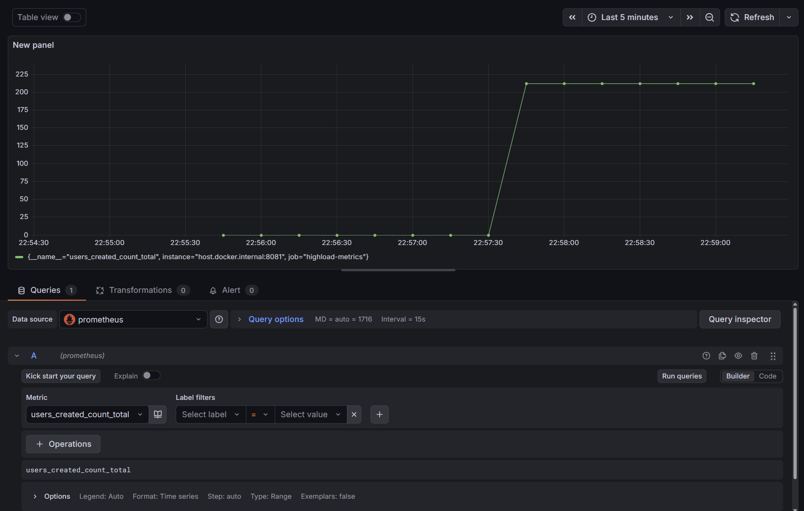

# highload

## Мониторинг и алертинг

### todo

- ~~развернуть zabbix;~~
- ~~развернуть prometheus;~~
- ~~развернуть grafana;~~
- начать писать в prometheus бизнес-метрики сервиса чатов по принципу RED;
- начать писать в zabbix технические метрики сервера с сервисом чатов;
- организовать дашборд в grafana;
- написать отчет со скриншотами
- обновить postman коллекцию
- проверить работу с основным docker compose

Требования:
- Сбор технических метрик осуществляется верно.
- Сбор бизнес метрик осуществляется верно по принципу RED.
- В grafana организован дашборд.

## Распределенные транзакции

- В результате выполнения ДЗ был разработан сервис счетчиков, который хранит число непрочитанных сообщений
- Для синхронизации данных между сервисами без жесткой связности применен паттерн хореографической Saga на базе kafka
- Есть некий сервис, назовем его `messanger`, который сохраняет сообщение в свою БД и публикует событие в топик kafka `message-create-topic` (не реализовано). Сервис счетчиков (counter) слушает топик `message-create-topic`, при получении сообщения он в рамках транзакции увеличивает счетчик в postgres и обновляет кэш в redis
- Компенсирующая транзакция: Если сообщение было успешно сохранено в `messanger` и счетчик в `counter` увеличился на 1, но на следующем этапе например, при отправке push уведомления, произошла ошибка, отправляется компенсирующая транзакция в топик `message-rollback-topic`. Сервис `counter` асинхронно обрабатывает его и делает декремент счетчика в postgres и redis, возвращая систему в исходное консистентное состояние
- Если сервис counter недоступен, сообщения копятся в kafka. Как только работоспособность сервиса восстановится, он начнет вычитывать новые сообщения из kafka, `eventual consistency`
- Добавлен эндпоинт GET `/counters/unread/{userId}`, при вызове которого возвращается ответ из редиса по кол-ву непрочитанных сообщений пользователя
- Поднимаем контейнеры
  ```
  docker compose up -d
  ```
- Пример сообщения кафки инкремента
  ```
  {
    "sagaId": "4f7b6c21-12a3-4b67-a89c-d2ef56789abc",
    "messageId": "123",
    "recipientId": "222",
    "senderId": "777"
  }
  ```
- Пример сообщения кафки декремента
  ```
  {
    "sagaId": "4f7b6c21-12a3-4b67-a89c-d2ef56789abc",
    "recipientId": "222",
    "reason": "Галя, у нас отмена!"
  }
  ```

## Балансировка и отказоустойчивость

- Поднимаем контейнеры
  ```
  docker compose up -d
  ```
- haproxy
  - Поднимется 3 инстансов postgres, один мастер и 2 слейва
  - В качестве postgres образов выбрал образы от `bitnami`, они автоматически настраивают репликацию через переменные окружения
  - Соединение со слейвами postgres реализовано через `haproxy`. Конфигурация haproxy находится в файле `haproxy.cfg` в корне проекта
  - Настроил приложение, чтобы оно работало с несколькими инстансами postgres. Запросы на чтение идут на слейвы, запросы на запись идут на мастер. В логах можно увидеть запись
    ```
    === Sql запрос отправлен на SLAVE ===
    ```
  - Создал нагрузку на приложение, постоянно вызывая метод GET `/user/search`. Отключил один из слейвов postgres. Убедился, что система осталась работоспособной, запросы продолжали идти на рабочий слейв и возвращался 200 ответ
- nginx
  - Поднимется 2 инстанса бэкенда, сервиса `app`
  - Балансировка бэкенда реализована с помощью nginx. Конфигурация nginx находится в файле `nginx.conf` в корне проекта
  - Создал нагрузку на приложение, постоянно вызывая метод GET `/user/search`. Отключил один инстанс бэкенда. Убедился, что система осталась работоспособной, запросы продолжали идти на рабочий инстанс и возвращался 200 ответ

## Разделение монолита на сервисы

- Приложение разделено на модули. Взаимодействие модулей происходит по REST API
  - app: основное приложение
  - auth: модуль авторизации. Реализован не очень хорошо. Обращается к модулю `app` для получения информации по юзеру, по-хорошему нужно делать отдельную бд для этого модуля. Так же, в других модулях есть дублирование функционала по авторизации, что тоже не есть хорошо, не стал с этим заморачиваться, так как по дз нужно сделать другое
  - common: общий функционал для всех модулей
  - dialog: функционал диалогов, требовалось сделать по дз
- Предусмотрено, что можно ходить через старое API диалогов в модуле `app`
  - Старые контроллеры выступают прокси - перенаправляют запрос в новый микросервис `dialog`
- Организовано сквозное логирование запросов (x-request-id)
  - При вызове метода GET `/dialog/{user_id}/list` в модуле `app` с заголовком `x-request-id: 354` в логах будет сообщение `INFO [appName: app, traceId: b74be4297fe4feadf3c1ad85ad16bae2, spanId: e93cb5dc7f097a98, xRequestId: 354]`
  - Далее будет вызван метод GET `/dialog/{user_id}/list` в модуле `dialog`, в логах будет сообщение `INFO [appName: dialog, traceId: b74be4297fe4feadf3c1ad85ad16bae2, spanId: c8a27f40402db468, xRequestId: 354]`

## In-Memory СУБД

- сгенерировал 300 тысяч записей в таблице dialog_messages
- реализовал выборку из tarantool батчами, так как было ограничение по передаче данных по сети 1 мб. Сортировку вынес в java
- провел нагрузочное тестирование `до` вынесения данных из postgres в tarantool, отчеты приложены в папке `/jmeter/reports/in-memory/with-postgres/`
  - метод GET "/dialog/{user_id}/list" отрабатывает в среднем 25+ секунд
- провел нагрузочное тестирование `после` вынесения данных из postgres в tarantool, отчеты приложены в папке `/jmeter/reports/in-memory/with-tarantool/`
  - метод GET "/dialog/{user_id}/list" отрабатывает гораздо быстрее, около 4 секунд
- чтобы проверить локально, необходимо выполнить шаги:
  - запустить миграцию данных из postgres в tarantool вызвав метод POST `/dialog/migrate`
    - подключиться к tarantool `docker exec -it tarantool console` и убедить, все записи были мигрированы из postgres в tarantool `box.space.messages:len()`
  - авторизоваться под юзером `1a03ae84-5a4c-4dfd-b99b-ccbf9677acb6` вызвав метод POST `http://localhost:8081/login`
    - body `{"id": "1a03ae84-5a4c-4dfd-b99b-ccbf9677acb6", "password": "12345678"}`
  - получить диалоги методом GET `http://localhost:8081/dialog/902731e2-92bb-4884-a2d2-4ed94061860d/list`
    - в заголовке `Authorization` указать ранее полученный токен методом POST `http://localhost:8081/login`

## Очереди и отложенное выполнение

- Был доработан функционал ленты новостей, поддерживающий масштабируемость и доставку постов друзьям автора через RabbitMQ и WebSocket
- В `PostService` при создании поста выполняется поиск всех id друзей и для каждого генерируется уникальный Routing Key вида `post.feed.posted.{friendId}`
- Реализован `PostEventListener`, который слушает события из RabbitMQ и транслирует их в WebSocket каналы `/post/feed/posted/{friendId}`. В `PostEventListener` реализован перехват события подписки, как только друг подписывается на свою ленту `/post/feed/posted/{myId}`, приложение на лету создает в RabbitMQ связь между этим ключом и очередью конкретного инстанса сервиса. Это гарантирует, что сообщение получат только целевые пользователи
- Используется `AnonymousQueue`, уникальная очередь для каждого запущенного инстанса приложения, позволяет запускать любое количество нод сервиса. Если автор и его друг подключены к разным серверам, RabbitMQ сам доставит сообщение на тот узел, где есть активная подписка по соответствующему Routing Key
- Для обеспечения стабильной работы брокера при росте количества пользователей и постов, масштабирование в RabbitMQ будет происходить следующим образом:
  - Объединить несколько серверов RabbitMQ в кластер. Это позволяет распределить нагрузку между разными узлами. При нехватке мощности в кластер можно добавить новый сервер
  - Используется `Topic Exchange`, который позволяет брокеру мгновенно находить нужных получателей по ключу Routing Key, не перебирая все сообщения подряд, что обеспечивает отправку только целевым пользователям
  - Используются временные очереди `AnonymousQueue`, которые гарантирует, что RabbitMQ не хранит лишние данные, как только инстанс приложения выключается, его очередь и все привязки удаляются автоматически, освобождая память брокера
- Поднимаем контейнеры
  ```
  docker compose -f .\docker-compose-queue.yml up -d
  ```
- Подписываемся на канал `"/post/feed/posted/" + myUserId` в консоли браузера. В `myUserId` указать id юзера, который является другом юзера с id `1a03ae84-5a4c-4dfd-b99b-ccbf9677acb6`
  ```
  var myUserId = '082aa703-1a3c-4e22-a4c5-cdf549d2535f';
  var myTopic = "/post/feed/posted/" + myUserId;
  var socket = new WebSocket('ws://localhost:8081/ws?userId=' + myUserId);
  var isSubscribed = false;
  
  socket.onopen = () => {
      console.log('--- СОЕДИНЕНИЕ УСТАНОВЛЕНО ---');
      socket.send("CONNECT\naccept-version:1.1,1.0\n\n\0");
  };
  
  socket.onmessage = (e) => {
      console.log('ОТВЕТ СЕРВЕРА:', e.data);
  
      if (e.data.includes("CONNECTED") && !isSubscribed) {
        socket.send("SUBSCRIBE\nid:sub-0\ndestination:" + myTopic + "\n\n\0");
        console.log('--- ПОДПИСКА ОФОРМЛЕНА НА: ' + myTopic + ' ---');
        isSubscribed = true;
      }
      
      if (e.data.includes("ERROR")) {
          console.error('Ошибка авторизации или протокола:', e.data);
      }
  };
  
  socket.onerror = (err) => console.error('ОШИБКА СОКЕТА:', err);
  ```
- Вызываем метод авторизации POST `http://localhost:8081/login` для юзера с id `1a03ae84-5a4c-4dfd-b99b-ccbf9677acb6`
- Создаем новый пост POST `http://localhost:8081/post/create` для юзера с id `1a03ae84-5a4c-4dfd-b99b-ccbf9677acb6`
- Всем друзьям юзера с id `1a03ae84-5a4c-4dfd-b99b-ccbf9677acb6`, которые подписаны на ленту, будет отправлено сообщение через WebSocket
  ```
  {"postId":"e9a03a65-1bc3-4691-8140-1d622272d393","postText":"Текст поста","author_user_id":"1a03ae84-5a4c-4dfd-b99b-ccbf9677acb6"}
  ```

## Шардирование

- Создана таблица `dialog_messages(id, dialog_id, sender_id, recipient_id, message_text, is_read, created_at, updated_at)`. Поле `dialog_id` является уникальным хешем от пары UUID пользователей, он всегда будет одинаковый для любого направления переписки (user1 -> user2 или user2 -> user1)
- Реализованы api:
  - POST `/dialog/{user_id}/send`: Сохранение нового сообщения
  - GET `/dialog/{user_id}/list`: Получение истории переписки между двумя пользователями
- Данные в запросе `/dialog/{user_id}/list` сортируются по условию: сначала не прочитанные сообщения для текущего пользователя, затем остальные сообщения по новизне
- В качестве ключа шардирование выбрано поле `dialog_id`. При вызове `/dialog/{user_id}/send` создается уникальный UUID на основе id двух пользователей. Все сообщения между двумя пользователями всегда будут сохраняться на одном шарде и при вызове `/dialog/{user_id}/list` Citus будет направлять запросы только на один шард
- Обновлена postman-коллекции `postman/highload.postman_collection.json`

### Шардирование. Практика

- Поднимаем контейнеры
  ```
  docker compose -f .\docker-compose-sharding.yml -p citus up --scale worker=2 -d
  ```
- Подключаемся к координатору
  ```
  docker exec -it citus-master psql -U postgres
  ```
- Регистрируем воркеры
  ```
  SELECT * FROM citus_add_node('citus-worker-1', 5432);
  SELECT * FROM citus_add_node('citus-worker-2', 5432);
  ```
- Создаем распределенную (шардированную) таблицу
  ```
  SELECT create_distributed_table('dialog_messages', 'dialog_id');
  ```
- Посмотрим план запроса, select теперь распределенный и пойдет на все шарды
  ```
  explain select * from dialog_messages limit 10;
  ```
- Убедимся, что запрос на получение диалога между двумя пользователями ходит всегда на 1 шард
  ```
  explain SELECT sender_id, recipient_id, message_text, is_read, created_at
  FROM dialog_messages
  WHERE dialog_id = 'b448694f-80bc-3519-bc0f-53ddbb355a3b'
  ORDER BY
      (recipient_id = '046e74fd-ca67-4311-b081-ece8b2fd292a' AND is_read = FALSE) DESC,
      created_at DESC;
  ```
  ```
  -----------------------------------------------------------------------------------------------------------------------------------
  Custom Scan (Citus Adaptive)  (cost=0.00..0.00 rows=0 width=0)
  Task Count: 1
  Tasks Shown: All
  ->  Task
  Node: host=citus-worker-1 port=5432 dbname=postgres
  ->  Sort  (cost=11.31..11.32 rows=3 width=74)
  Sort Key: (((recipient_id = '046e74fd-ca67-4311-b081-ece8b2fd292a'::uuid) AND (NOT is_read))) DESC, created_at DESC
  ->  Bitmap Heap Scan on dialog_messages_102012 dialog_messages  (cost=4.17..11.29 rows=3 width=74)
  Recheck Cond: (dialog_id = 'b448694f-80bc-3519-bc0f-53ddbb355a3b'::uuid)
  ->  Bitmap Index Scan on dialog_messages_pkey_102012  (cost=0.00..4.17 rows=3 width=0)
  Index Cond: (dialog_id = 'b448694f-80bc-3519-bc0f-53ddbb355a3b'::uuid)
  (11 rows)
  ```
- Добавим дополнительные шарды
  ```
  docker compose -f .\docker-compose-sharding.yml -p citus up --scale worker=5 -d
  ```
- Регистрируем воркеры
  ```
  SELECT * FROM citus_add_node('citus-worker-3', 5432);
  SELECT * FROM citus_add_node('citus-worker-4', 5432);
  SELECT * FROM citus_add_node('citus-worker-5', 5432);
  ```
- Проверим, видит ли координатор новые шарды
  ```
  SELECT master_get_active_worker_nodes();
  ```
- Посмотрим на каких узлах лежат сейчас данные
  ```
  SELECT nodename, count(*) FROM citus_shards GROUP BY nodename;
  ```
- Установим wal_level = logical, чтобы узлы перенесли данные
  ```
  alter system set wal_level = logical;
  SELECT run_command_on_workers('alter system set wal_level = logical');
  ```
- Перезапускаем все узлы в кластере, чтобы применился wal_level
  ```
  docker compose -f .\docker-compose-sharding.yml -p citus restart
  ```
- Убедимся, что wal_level изменился
  ```
  docker exec -it citus-worker-1 psql -U postgres
  
  show wal_level;
  ```
- Запустим ребалансировку на координаторе
  ```
  docker exec -it citus-master psql -U postgres
  
  SELECT citus_rebalance_start();
  ```
- Проверим статус ребалансировки
  ```
  SELECT * FROM citus_rebalance_status();
  ```
- Проверяем, что данные равномерно распределились по шардам
  ```
  SELECT nodename, count(*) FROM citus_shards GROUP BY nodename;
  ```

## Кеширование

- Добавил методы по добавлению/удалению друга
- Добавил CRUD для постов пользователей, методы `/post/create, /post/update, /post/delete/{id}, /post/get/{id}`
- Реализовал ленту постов друзей `/post/feed`
- БД заполняется тестовыми юзерами и постами при старте приложения
- Лента постов кешируется. В ленте хранятся последние 1000 постов
- Используется структура данных Redis Список с ключем `feed:{userId}`, в которой хранятся только id постов. Сами посты хранятся как отдельные строки с ключами `post:{postId}`, это исключает дублирование, один пост хранится только один раз
- Кеш автоматически инвалидируется через 24 часа
- Для принудительной перестройки кеша пользователя, сделан метод POST `/post/rebuild`
- Кеш обновляется при создании, обновлении и удалении постов

## Репликация

- Составил план нагрузочного тестирования в jmeter для запросов /user/get/{id} и /user/search
- Создал нагрузку на чтение для этих запросов. Отчет лежит в папке `jmeter/reports/replication/reading-load-without-replication`
- Поднял в докере 2 слейва и 1 мастер
- Запомнил маску сети
`docker network inspect highload | grep Subnet`
- Раскоментировал конфиги в файле `volumes/postgres-master/postgresql.conf`
  ```
  ssl = off
  wal_level = replica
  max_wal_senders = 10
  ```
- Подключился к мастеру и создал пользователя для репликации
  ```
  docker exec -it highload-master psql -U highload-user -d postgres
  create role replicator with login replication password 'pass';
  exit
  ```
- Добавил запись с подсетью
`host    replication     replicator      172.18.0.0/16           md5` в файл `volumes/postgres-master/pg_hba.conf`
- Перезапустил мастер
- Сделал бэкап для реплик
  ```
  docker exec -it highload-master bash
  mkdir /pgslave
  pg_basebackup -h highload-master -D /pgslave -U replicator -v -P --wal-method=stream
  exit
  ```
- Скопировал бэкап себе в проект в первую реплику
  ```
  rm -rf volumes/postgres-slave-1/
  docker cp highload-master:/pgslave volumes/postgres-slave-1/
  ```
- Создал файл в реплике, чтобы она узнала, что она реплика
  ```
  touch volumes/postgres-slave-1/standby.signal
  ```
- Поменял `postgresql.conf` на реплике `postgres-slave-1`
  ```
  primary_conninfo = 'host=highload-master port=5432 user=replicator password=pass application_name=postgres-slave-1'
  ```
- Скопировал бэкап во вторую реплику
  ```
  rm -rf volumes/postgres-slave-2/
  docker cp highload-master:/pgslave volumes/postgres-slave-2/
  ```
- Изменил настройки для второй реплики `volumes/postgres-slave-2/postgresql.conf`
  ```
  primary_conninfo = 'host=highload-master port=5432 user=replicator password=pass application_name=postgres-slave-2'
  ```
- Создал файл во второй реплике, чтобы она узнала, что она реплика
  ```
  touch volumes/postgres-slave-2/standby.signal
  ```
- Перезапустил обе реплики
- Убедился что обе реплики работают в асинхронном режиме на highload-master
  ```
  docker exec -it highload-master psql -U highload-user -d postgres
  select application_name, sync_state from pg_stat_replication;
  exit
  ```
- Включил синхронную репликацию на highload-master
  - поменял файл postgres-master/postgresql.conf
  ```
  synchronous_commit = on
  synchronous_standby_names = 'FIRST 1 ("postgres-slave-1", "postgres-slave-2")'
  ```
    - перезагрузил конфиг
  ```
  docker exec -it highload-master psql -U highload-user -d postgres
  select pg_reload_conf();
  exit
  ```
- Убедился, что реплики стали синхронной
  ```
  docker exec -it highload-master psql -U highload-user -d postgres
  select application_name, sync_state from pg_stat_replication;
  exit
  ```
  
### Кворумная репликация

- Доработал приложение, добавил `TransactionRoutingDataSource`, который выбирает использовать master или slave в зависимости от типа транзакции. Запросы на чтение идут на слейвы, запросы на запись идут на мастер
- Создал нагрузку на чтение, отчеты приложены в папке `/jmeter/reports/replication/`. Чтение из бд без репликации примерно в 2 раза быстрее, чем с двумя репликами. По идее должно быть наоборот. Возможно проблема в докере, контейнеры борются за ресурсы
- Настроил кворумную синхронную репликацию используя patroni
- Убедился, что кластер запустился, patroni выбрал лидера и реплики успешно подключились к новому лидеру
  ```
  docker exec -it -e PATRONI_ETCD3_HOSTS=etcd:2379 highload-master patronictl -c //home/postgres/patroni.yml list

  + Cluster: highload-cluster (7608674574716248089) ----------+----+-----------+
  | Member           | Host             | Role    | State     | TL | Lag in MB |
  +------------------+------------------+---------+-----------+----+-----------+
  | highload-master  | postgres-master  | Leader  | running   |  1 |           |
  | highload-slave-1 | postgres-slave-1 | Replica | streaming |  1 |         0 |
  | highload-slave-2 | postgres-slave-2 | Replica | streaming |  1 |         0 |
  +------------------+------------------+---------+-----------+----+-----------+
  ```
- Убедился, что реплики работают в кворумной репликации
  ```
  docker exec -it highload-master psql -h 127.0.0.1 -U highload-user -d postgres -c "SELECT application_name, state, sync_state FROM pg_stat_replication;"

  application_name |   state   | sync_state
  ------------------+-----------+------------
  highload-slave-1 | streaming | quorum
  highload-slave-2 | streaming | quorum
  (2 rows)
  ```
- Создал нагрузку на запись в таблицу users. Настроил метрики для подсчета, сколько строк мы успешно записали
- 
- Остановил мастер узел
- Patroni сам выбрал свежий слейв и промоутил его до мастера
  ```
  docker exec -it -e PATRONI_ETCD3_HOSTS=etcd:2379 highload-slave-1 patronictl -c //home/postgres/patroni.yml list
  
  + Cluster: highload-cluster (7609054903417151516) ----------+----+-----------+
  | Member           | Host             | Role    | State     | TL | Lag in MB |
  +------------------+------------------+---------+-----------+----+-----------+
  | highload-slave-1 | postgres-slave-1 | Leader  | running   |  2 |           |
  | highload-slave-2 | postgres-slave-2 | Replica | streaming |  2 |         0 |
  +------------------+------------------+---------+-----------+----+-----------+
  ```
  - Без patroni:
  - На каждом слейве выполнить запрос. Свежий слейв будет тот, у которого LSN больше
  ```
  SELECT 
    pg_last_wal_receive_lsn() AS received_lsn,
    pg_last_wal_replay_lsn() AS applied_lsn,
    pg_is_in_recovery() AS is_slave;
  ```
  - Промоутим свежий слейв до мастера
  ```
  SELECT pg_promote();
  ```
  - На втором слейве обновляем конфиг primary_conninfo в postgresql.conf
  ```
  primary_conninfo = 'host=highload-slave-1 port=5432 user=replicator password=pass'
  ```
  - Перезапускаем второй слейв
- Проверил, что нет потерь транзакций
  - Сравнил в логах приложения кол-во JdbcTemplate записей с ответом 200 и кол-во записей в бд, одинаково

## Производительность индексов

- выполнить bash скрипт `src/main/resources/import/import-people.sh`, который заполнить таблицу `users` данными из файла `people.v2.csv`
  - в скрипте надо указать путь к `psql.exe`
- Отчеты jMeter лежат в папке `/jmeter/reports/indexes/`
- Запрос на добавление составного индексов
  ```
  CREATE INDEX idx_users_names ON users (LOWER(first_name) text_pattern_ops, LOWER(second_name) text_pattern_ops, id ASC);
  ```

- Explain запросов после индекса
  ```
  EXPLAIN ANALYZE
  SELECT *
  FROM users 
  WHERE LOWER(first_name) LIKE 'а%' AND LOWER(second_name) LIKE 'и%'
  ORDER BY id ASC;

  "Sort  (cost=344.51..344.57 rows=25 width=669) (actual time=16.086..16.389 rows=8082 loops=1)"
  "  Sort Key: id"
  "  Sort Method: quicksort  Memory: 1011kB"
  "  ->  Index Scan using idx_users_names on users  (cost=0.42..343.93 rows=25 width=669) (actual time=0.068..14.702 rows=8082 loops=1)"
  "        Index Cond: ((lower((first_name)::text) ~>=~ 'а'::text) AND (lower((first_name)::text) ~<~ 'б'::text) AND (lower((second_name)::text) ~>=~ 'и'::text) AND (lower((second_name)::text) ~<~ 'й'::text))"
  "        Filter: ((lower((first_name)::text) ~~ 'а%'::text) AND (lower((second_name)::text) ~~ 'и%'::text))"
  "Planning Time: 0.075 ms"
  "Execution Time: 16.655 ms"
  ```
- Почему индекс именно такой
  - Использовался B-Tree составной индекс. Составной индекс работает быстрее, чем два отдельных, так как выполняет один проход по дереву и сразу получает отфильтрованный результат, в то время как два отдельных индекса требуют раздельного сканирования и последующего слияния. Для операций сравнения, включая поиск по префиксу, B-Tree работает быстрее чем GIN индекс. Так же в индексе используется оператор `text_pattern_ops`, который позволяет ускорить поиск по префиксу в текстовых полях

## Локальный запуск приложения

- выполнить команду `docker compose up -d`
  - будет поднята бд postgres
  - сбилдится и запустится spring приложение
  - таблицы в postgres будут созданы и заполнены при запуске приложения автоматически
- Postman-коллекции расположена по пути `postman/highload.postman_collection.json`
